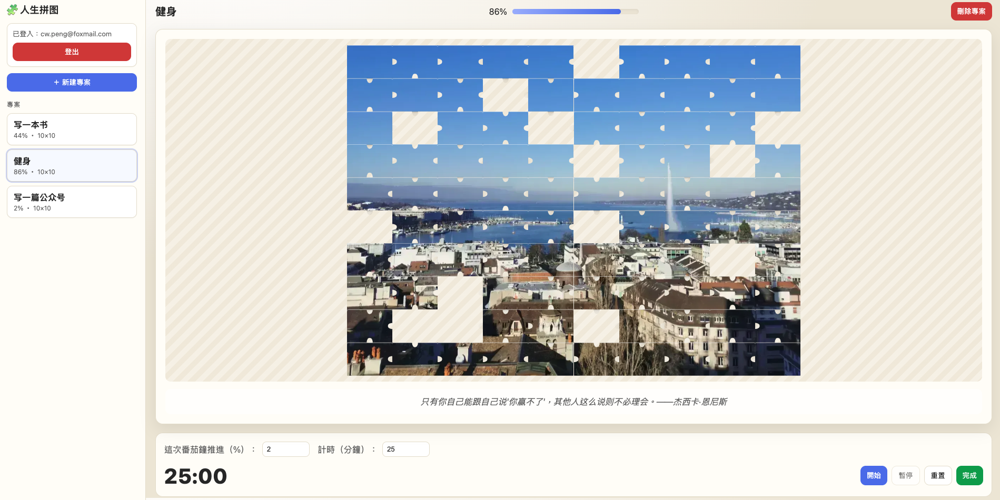

# 人生拼图

## 项目故事

「人生拼图」是一款结合 **拼图游戏**、**项目规划** 与 **番茄钟** 的效率工具。通过拼图化的方式管理任务，让项目进展像拼图一样，一块块逐步完成。



## 核心功能

- **拼图化任务管理**：将任务拆解为小块拼图，逐步完成。
- **项目规划**：可视化项目进度，清晰掌握每一步。
- **番茄钟专注**：结合番茄工作法，提升效率与专注力。

## 安装与运行

1. 克隆项目到本地：
   ```bash
   git clone <项目地址>
   ```
2. 进入项目目录：
   ```bash
   cd life-puzzle
   ```
3. 启动项目：
   ```bash
   python3 -m http.server 5173
   ```
4. 打开浏览器，访问：
   ```bash
   http://localhost:5173
   ```
## 贡献指南

欢迎贡献代码或提出建议！请提交 Pull Request 或 Issue。

## 许可证

本项目采用 MIT 许可证。